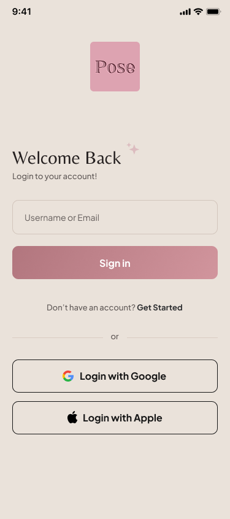
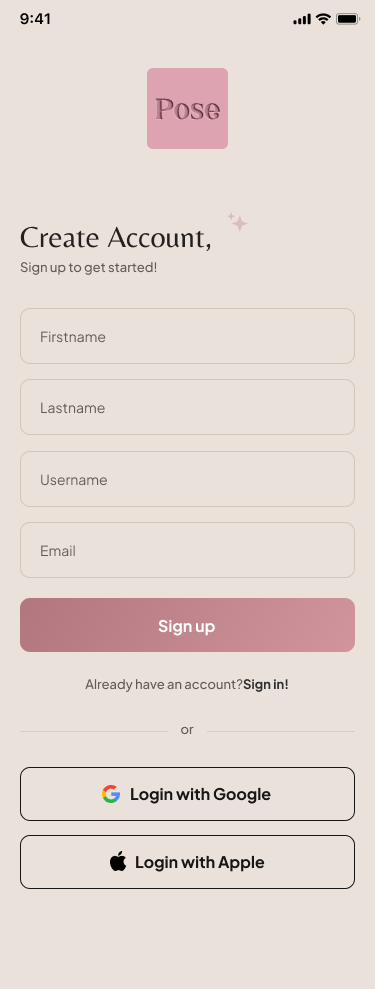
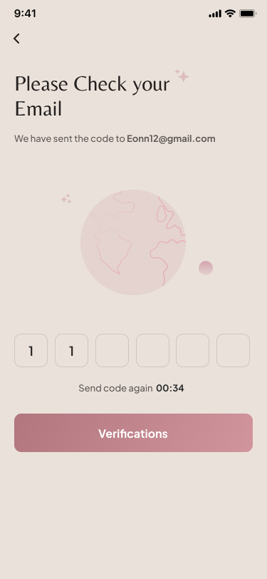
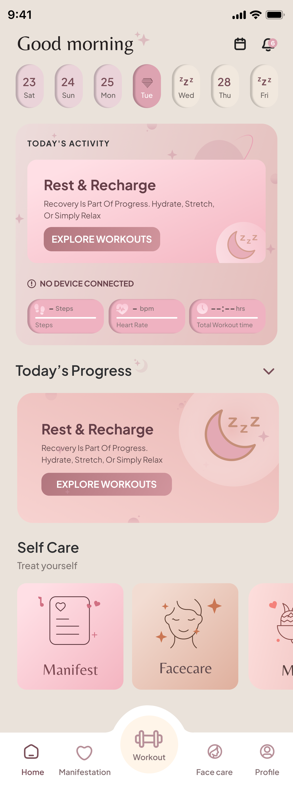
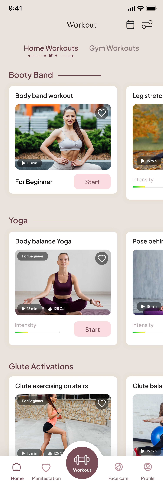
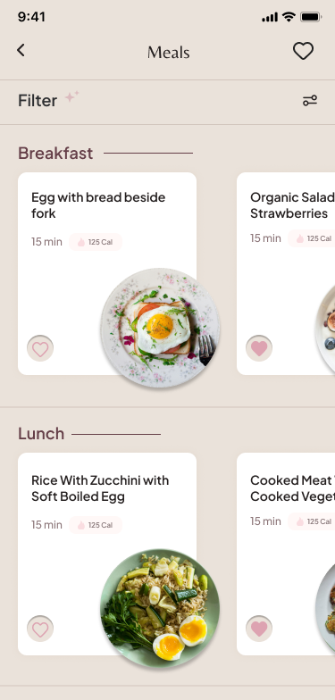
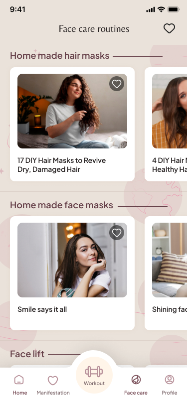
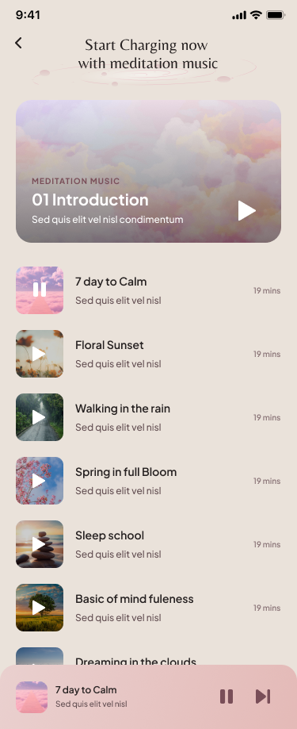
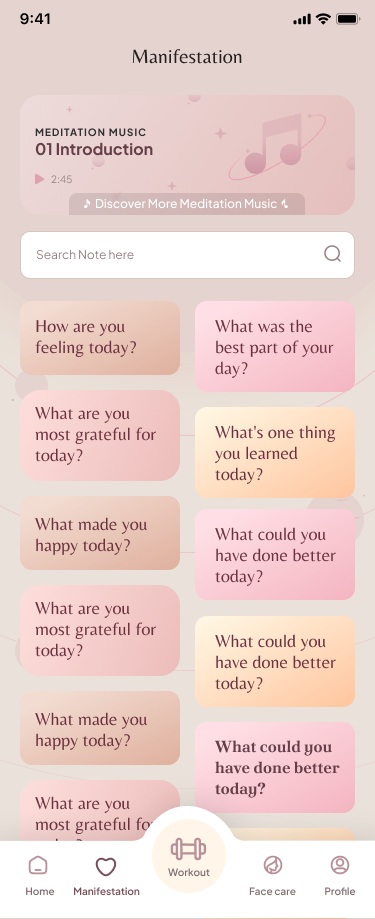
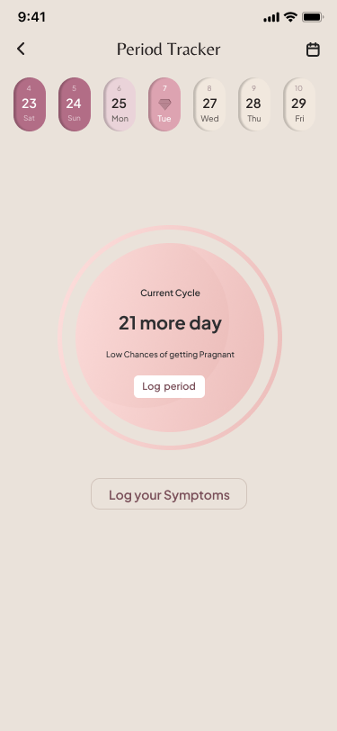

# 🏋️‍♂️ Posefit App

A high-performance, feature-packed cross-platform mobile application built using **Flutter**, **BLoC Pattern**, and **Clean Architecture**. This comprehensive health platform combines custom workout routines, personalized meal planning, daily skincare & hair care trackers, mindfulness meditation, period health tracking, and real-time community chat — all in a beautifully designed, offline-first experience.

> **Note on Source Code & NDA:**  
> The core repository and source code are private due to client non-disclosure agreements (NDA). This repository serves as a technical showcase featuring the app's architecture, UI/UX design, feature overview, and evaluation demos.

---

## 📱 App Screenshots & Visual Walkthrough
| Login | Sign In | Otp Verification | Home Screen |
| :---: | :---: | :---: | :---: |
|  |  |  |  |


| Workouts | Meals | Face & Hair Care Routine | Meditation & Mindfulness |
| :---: | :---: | :---: | :---: |
|  |  |  |  |

| Manifestation Journal | Friend Chats | Period Cycle | User Profile |
| :---: | :---: | :---: | :---: |
|  |  |  |  |

---

## 🚀 Key Features & Functionalities

### 1. 🏋️ Full Fitness & Guided Exercise Module
- **Personalized Workout Plans:** Tailored exercise routines based on fitness goals (weight loss, muscle build, flexibility) with dedicated workout preferences and goal editing screens.
- **Interactive Exercise Guide:** Smooth UI animations powered by `flutter_animate`, step-by-step video instructions via `cached_video_player_plus` & `chewie`, and rest timers optimized for 60FPS performance.
- **Activity & Progress Analytics:** Daily/weekly calorie, duration, and completion tracking rendered with `syncfusion_flutter_charts` dynamic charting and visual gauges via `syncfusion_flutter_gauges`.
- **Gamified Leaderboard & Achievements:** Community-wide leaderboard rankings and unlockable achievement badges to keep users motivated and competitive.

### 2. 🥗 Meal Planning & Calorie Tracking
- **Macro & Calorie Counter:** Dedicated nutrition section with dietary suggestions and macro breakdowns (Carbs, Protein, Fats), powered by interactive slider widgets (`syncfusion_flutter_sliders`).
- **Personalized Meal Recommendations:** Detailed meal plan views with scheduling based on target calorie intake and personal dietary preferences.

### 3. 🧴 Face Care & Hair Care Routines
- **Custom Skincare Modules:** AM/PM skincare and hair care routines with product recommendations, face mask guides, hair mask guides, and helpful wellness tips — organized across dedicated detail screens.
- **Self-Care Hub:** A centralized self-care module housing curated routines, progress tracking, and care-specific content.

### 4. 🧘 Mindfulness, Meditation & Manifestation Journal
- **Guided Audio Sessions:** Integrated background-capable audio playback via `just_audio`, `audio_service`, and `just_audio_background` for breathing exercises, relaxation music, and guided meditation — playback continues even when the app is minimized or the screen is locked.
- **Meditation Music Library:** A curated, browsable library of meditation tracks with smooth background audio management through a custom `MusicHandler` service.
- **Manifestation Journal:** Goal-setting tools, daily positive affirmations, and journaling features to encourage mindfulness and habit building.

### 5. 🩸 Period Tracker & Symptom Logger
- **Cycle Tracking:** Full menstrual cycle tracking with calendar views (`flutter_calendar_carousel`, `calendar_date_picker2`) and predictive cycle analytics.
- **Symptom Logging:** Detailed symptom logging module for tracking mood, energy, and physical symptoms throughout the cycle.

### 6. 💬 In-App Chat System & Community Support
- **Real-Time 1-on-1 Messaging:** Built-in WebSocket-powered chat system (`socket_io_client`) for direct personal coaching and support conversations, with automatic reconnection on app resume.
- **Group Chat & Community:** Dedicated group socket service for community group chats, enabling shared fitness journeys and peer motivation.

### 7. 🛒 Premium Subscription & In-App Purchases
- **In-App Purchase Integration:** Native IAP flow via `in_app_purchase` with clean architecture separation — dedicated use cases for product listing, purchase execution, and purchase restoration.
- **Coupon & Discount System:** Full coupon redemption module with discount calculation, offer validation, and platform-specific offer services.
- **Subscription Coordinator:** Centralized subscription management coordinating purchases, discounts, and entitlements.

### 8. 📲 Smart Notifications & Onboarding
- **Push Notifications:** Firebase Cloud Messaging (FCM) for workout reminders, routine nudges, and community updates with deep-link navigation support.
- **Local Notifications:** Timezone-aware local notifications (`flutter_local_notifications`, `flutter_timezone`) for scheduled routine reminders.
- **Interactive Onboarding:** Multi-step question-based onboarding flow to personalize the user experience from day one, with an interactive intro and feature showcase (`showcaseview`).

### 9. 📋 To-Do List & Daily Planner
- **Task Management:** Built-in to-do list for daily wellness planning — schedule workouts, meals, self-care routines, and meditation sessions in one place.

### 10. 🏥 Health Connect Integration
- **Platform Health Data:** Integration with device health APIs (`health` package) through platform-specific repositories (Android Health Connect & iOS HealthKit) for syncing steps, calories, heart rate, and activity data.

---

## 🛠️ Technical Architecture & Tech Stack

### Architecture Overview

```
lib/
├── config/                  # App theme & global configuration
├── constants/               # App-wide constants & shared preferences
├── core/                    # Core services, BLoCs, models & error handling
│   ├── bloc/                # Global BLoCs (Language, etc.)
│   ├── errors/              # Custom error types
│   ├── models/              # Shared domain models
│   ├── services/            # Service Locator (GetIt), Firebase Push,
│   │                        #   Health Repos, Audio Handler, Analytics,
│   │                        #   Cache Manager, Background Service
│   └── usecase/             # Base use case abstractions
├── features/                # Feature modules (Clean Architecture)
│   ├── coupon/              # Coupon & discount system
│   │   ├── data/            #   └── Data sources & repository impl
│   │   ├── domain/          #   └── Repository contracts & use cases
│   │   └── presentation/    #   └── BLoC (Events, States, Bloc)
│   └── in_app_purchase/     # IAP & subscription management
│       ├── data/            #   └── Data sources & repository impl
│       ├── domain/          #   └── Repos, use cases & domain services
│       └── presentation/    #   └── BLoC (Events, States, Bloc)
├── networking/              # API provider (HTTP client) & failure handling
├── router/                  # App routing (routes, pages, navigation)
├── ui/                      # UI feature modules (37 screens)
│   ├── work_out/            # Workout engine (data/domain/model/view)
│   ├── meal_plan/           # Meal planning (data/domain/model/view)
│   ├── facecare/            # Skincare routines (data/domain/view)
│   ├── Meditation_music_list/  # Meditation audio player
│   ├── Manifestation/       # Journal & affirmations
│   ├── chat/ & chat_view/   # Real-time messaging (Socket.IO)
│   ├── period_tracker/      # Cycle tracking & analytics
│   ├── activity/            # Activity dashboard & history
│   ├── leaderboard/         # Community rankings
│   ├── achievement/         # Achievement badges
│   ├── premium_screen/      # Subscription & checkout
│   ├── profile/             # User profile management
│   └── ...                  # 24 more feature screens
├── utils/                   # Utilities (socket services, date helpers,
│                            #   localization, video frame extraction)
└── widget/                  # Shared reusable UI components
```

### Clean Architecture Per Feature Module

Each feature module follows a strict **layered architecture**:

```
feature/
├── data/
│   ├── datasource/          # Remote & local data sources (API calls)
│   └── repos_impl/          # Concrete repository implementations
├── domain/
│   ├── repos/               # Abstract repository contracts
│   └── usecases/            # Business logic use cases
├── model/                   # Feature-specific data models
└── view/
    ├── bloc/                # BLoC (Events → States → Business Logic)
    └── screen/ & widget/    # UI presentation layer
```

### Tech Stack

| Layer | Technology |
|---|---|
| **Framework** | Flutter 3.x (Dart, SDK ≥3.2.6) |
| **Architecture** | Clean Architecture (Presentation → Domain → Data) |
| **State Management** | BLoC / Cubit (`flutter_bloc` 9.x) + Riverpod (selective) |
| **Dependency Injection** | GetIt (`get_it` 8.x) — Service Locator pattern |
| **Networking** | HTTP Client (`http`) with custom `ApiProvider`, WebSockets (`socket_io_client`) |
| **Real-Time Communication** | Socket.IO (1-on-1 chat, group chat, live activity sockets) |
| **Local Storage** | SharedPreferences for lightweight caching |
| **Media & Audio** | `just_audio` + `audio_service` + `just_audio_background` for background meditation playback |
| **Video Playback** | `cached_video_player_plus`, `chewie`, `video_player` for exercise guides |
| **Video Processing** | `ffmpeg_kit_flutter_new`, `video_compress`, `video_thumbnail` |
| **Charts & Gauges** | Syncfusion Charts, Gauges & Sliders for analytics dashboards |
| **Animations** | `flutter_animate`, `lottie` for micro-interactions & onboarding |
| **Health Integration** | `health` package — Android Health Connect & iOS HealthKit |
| **Authentication** | Firebase Auth, Google Sign-In, Apple Sign-In |
| **Crash Reporting** | Firebase Crashlytics with custom error boundaries |
| **Analytics** | Firebase Analytics |
| **Push Notifications** | FCM (`firebase_messaging`) + Local Notifications (`flutter_local_notifications`) |
| **In-App Purchases** | `in_app_purchase` with clean domain services |
| **Localization** | Custom localization with `flutter_localization` & `intl` |
| **Responsive Design** | `flutter_screenutil` for pixel-perfect adaptive layouts |
| **Functional Programming** | `fpdart` for Either-based error handling |
| **Typography** | Custom fonts — PlusJakartaSans, Belleza, Italianno, PoltawskiNowy |

---

## ⚡ Performance Optimizations Implemented

### 🎯 Smooth 60FPS Screen Transitions
- Optimized widget build cycles using `const` constructors and localized `BlocBuilder` / `BlocListener` scoping to minimize unnecessary rebuilds.
- `buildWhen` conditions on BLoC builders to prevent redundant UI updates.
- Efficient `ScreenUtilInit` configuration with `minTextAdapt` for responsive rendering without layout recalculations.

### 📴 Offline-First Architecture
- Workouts, daily routines, self-care logs, and manifestation entries are cached locally to provide seamless usage without active internet connectivity.
- Custom `CacheManager` service for intelligent asset caching (`flutter_cache_manager`).
- Graceful offline handling in `ApiProvider` — returns structured error responses (503) with connectivity detection (`connectivity_plus`) so the UI degrades gracefully.

### 🎵 Background Audio Management
- Custom `MusicHandler` extending `BaseAudioHandler` ensures meditation audio continues playing when the app is backgrounded or the screen is locked.
- Android foreground service notification with channel configuration for uninterrupted audio sessions.

### 🔌 Smart WebSocket Lifecycle
- Socket connections for chat, group chat, and activity feeds are automatically managed through `AppLifecycleState` observers — sockets reconnect on resume and cleanly dispose on pause/detach to conserve battery and bandwidth.

### 🛡️ Robust Error Handling
- Typed `Failure` hierarchy (`BadRequestFailure`, `UnauthorizedFailure`, `ForbiddenFailure`, `RequestTimeoutFailure`, etc.) with centralized `apiHandle` for consistent error propagation.
- Firebase Crashlytics integration capturing both Flutter framework errors and platform-level exceptions via `PlatformDispatcher.instance.onError`.

---

## 📐 Design & UI Highlights

- **Custom Theme System:** Centralized `AppTheme` with curated color palette, Material 3 design tokens, and custom time picker / scrollbar theming.
- **Premium Typography:** Four custom font families (PlusJakartaSans for body, Belleza & Italianno for accent, PoltawskiNowy for bold headings) providing a luxury wellness aesthetic.
- **Rich Media Assets:** Organized asset pipeline — SVG icons, images, video content, and locale files with resolution-aware loading.
- **Smooth Micro-Animations:** `flutter_animate` and `lottie` for polished transitions, loading states, and interactive feedback.
- **Carousel & Calendar Views:** `carousel_slider` for feature spotlights and `flutter_calendar_carousel` for intuitive date-based tracking.
- **Haptic Feedback:** `vibration` package integration for tactile user interactions.

---

## 🎥 Live Demos & Deliverables

- **📹 Watch Video Walkthrough:** [Click Here to Watch Demo Video](https://your-video-link-or-drive.com)
- **📲 Download Demo APK:** [Download Android APK](https://your-google-drive-apk-link.com)
- **🍏 TestFlight Beta Link:** [Test on TestFlight](https://your-testflight-link.com)

---

## 📬 Contact & Evaluation

Developed by **Venis Vasani** — Senior Flutter Developer & Mobile Architect.

| | |
|---|---|
| 🌐 **Portfolio** | [venis-vasani.web.app](https://venis-vasani.web.app/) |
| 💼 **LinkedIn** | [linkedin.com/in/venis-vasani](https://linkedin.com/in/venis-vasani-727377216) |
| 📧 **Email** | venishvasani1113@gmail.com |

---

<p align="center">
  <i>Built with ❤️ using Flutter • Clean Architecture • BLoC Pattern</i>
</p>
